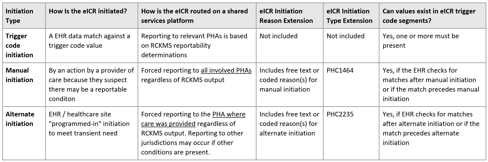

[Previous Page](profiles.html)

### Electronic Initial Case Report (eICR) Transaction and Profiles

The eICR transaction involves the transmission of data identified by a Council of State and Territorial Epidemiologists Task Force as being important to a case report. 

An eICR document can be automatically initiated by matching on trigger codes, manually initiated by an action of the provider of care because they suspect there may be a reportable condition or alternately initiated by automated, forced reporting. The following matrix illustrates the types of initiation:

<table><tr><td></td></tr></table>

The eICR also includes a step toward a structured travel history, pregnancy information, occupational data, therapeutic response to medication, homeless information and a vital sign snapshot. The eICR may be conveyed through FHIR messaging or as an unsolicited push transaction from healthcare to public health (see <a href="Transport_Options.html">Transport Options</a> for further details). There may be several different intermediaries involved in the transmission including Health Information Exchanges, Health Data Networks, and the Association of Public Health Laboratories (APHL) AIMS platform. 

In the FHIR eICR transaction to PHAs the RR payload may be added to provide the PHAs with information about what has been determined to be reportable, what PHAs have been sent eICR information, and what else has been communicated to healthcare.

The following profiles and extensions have been defined for the eICR transactions. The eICR Composition profile is the starting point for the transaction and all the other profiles are referenced from that profile (see diagram below for the main profile relationships).

#### Profiles
<ul>
  <li><b>Starting point:</b> <a href="StructureDefinition-eicr-composition.html">eICR Composition</a></li>
  <li><a href="StructureDefinition-ecr-patient.html">eICR Patient</a></li>
  <li><a href="StructureDefinition-ecr-practitionerrole.html">eICR PractitionerRole</a></li>
  <li><a href="StructureDefinition-ecr-organization.html">eCR Organization</a></li>
  <li><a href="StructureDefinition-eicr-encounter.html">eICR Encounter</a></li>
	<li><a href="StructureDefinition-eicr-condition.html">eICR Condition</a></li>
  <li><a href="StructureDefinition-eicr-servicerequest.html">eICR Lab Order</a></li>
  <li><a href="StructureDefinition-eicr-location.html">eICR Location</a></li>
  <li><a href="StructureDefinition-pregnancy-status-observation.html">Pregnancy Status Observation</a></li>
  <li><a href="StructureDefinition-pregnancy-outcome-observation.html">Pregnancy Outcome Observation</a></li>
  <li><a href="StructureDefinition-last-menstrual-period.html">Last Menstrual Period</a></li>
  <li><a href="StructureDefinition-postpartum-status.html">Postpartum Status</a></li>
  <li><a href="StructureDefinition-travel-history-observation.html">Travel History Observation</a></li>
</ul>

#### Extensions
<ul>
  <li><a href="StructureDefinition-eicr-trigger-code-flag-extension.html">eICR Trigger Code Flag Extension</a></li>
	<li><a href="StructureDefinition-eicr-initiation-type-extension.html">eICR Initiation Type Extension</a></li>
  <li><a href="StructureDefinition-eicr-initiation-reason-extension.html">eICR Manually Initiated Reason Extension</a></li>
  <li><a href="StructureDefinition-ecr-organization-extension.html">eCR Organization Extension</a></li>
  <li><a href="StructureDefinition-travel-history-address-extension.html">Travel History Address Extension</a></li>
  <li><a href="StructureDefinition-therapeutic-medication-response-extension.html">Therapeutic Medication Response Extension</a></li>
	<li><a href="StructureDefinition-date-determined-extension.html">Date Determined Extension</a></li>
	<li><a href="StructureDefinition-date-recorded-extension.html">Date Recorded Extension</a></li>
</ul>

<table><tr><td></td></tr></table>

[Next Page](Reportability_Response_(RR)_Transaction_and_Profiles.html)