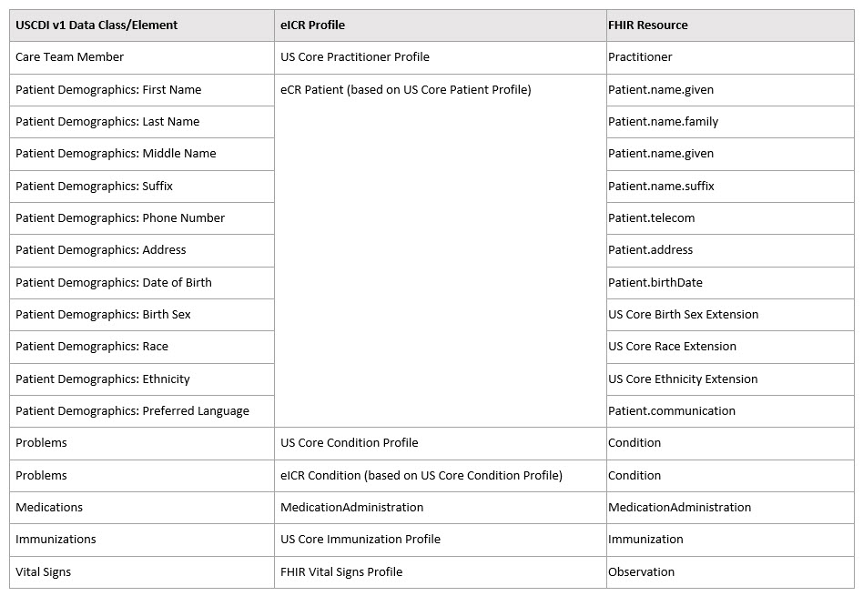

[Previous Page](Reportability_Response_Narrative_Guidance.html)

In coordination with the publication of this FHIR standard, an updated version 2.0 of the [HL7 CDA R2 Electronic Initial Case Report (eICR) Standard for Trial Use (STU) IG](http://www.hl7.org/implement/standards/product_brief.cfm?product_id=436) (see the link under "STU Documents" for STU 2.0) is also being published. The FHIR [eICR transaction](Electronic_Initial_Case_Report_(eICR)_Transaction_and_Profiles.html) in this implementation guide and the separately published CDA eICR implementation guide standard will now be maintained in tight coordination with each other. 
 
In order to get data as readily as possible from clinical care and minimize provider burden, the CDA eICR was built extensively on published [HL7 Consolidated CDA Templates for Clinical Notes (C-CDA R2.1)](http://www.hl7.org/implement/standards/product_brief.cfm?product_id=492) templates. The FHIR eICR transaction reuses many of the [HL7 FHIR US Core Implementation Guide STU 3](http://hl7.org/fhir/us/core/) profiles, and has been mapped to both the [Common Clinical Data Set (CCDS)](https://www.healthit.gov/sites/default/files/ccds_reference_document_v1_1.pdf), and now, the [(U.S. Core Data for Interoperability) USCDI](https://www.healthit.gov/isa/us-core-data-interoperability-uscdi). There are some eICR data, critical to public health activities, that are in the eICR transaction but not in the USCDI at this time. As well,some USCDI data are not legally authorized for delivery to public health agencies in the context of case reporting, but every effort will be made in an ongoing way to minimize variations from the USCDI. The following table illustrates a high-level mapping from USCDI v1 to eICR:

<table><tr><td></td></tr></table>

 
Both the CDA and FHIR versions of the eICR are intended to be used as an all-jurisdiction, all-condition report to public health agencies from EHRs. The eICR was created from a Council of State and Territorial Epidemiologists (CSTE) Task Force recommendation that identified necessary data to support case reporting. There is also an existing [HL7 CDA R2 Reportability Response (RR) STU IG](https://www.hl7.org/implement/standards/product_brief.cfm?product_id=470) that supports several functions for providing information back to clinical care in response to received eICRs. A [FHIR version of the CDA Reportability Response transaction](Reportability_Response_(RR)_Transaction_and_Profiles.html) is included in this eCR FHIR implementation guide. 
 
This aggregate FHIR electronic case reporting STU implementation guide (hereby known as FHIR eCR) also includes an [electronic Reporting and Surveillance Distribution (eRSD) transaction](Electronic_Reporting_and_Surveillance_Distribution_(eRSD)_Transaction_and_Profiles.html) that includes the Reportable Condition Trigger Codes (RCTC) and other reporting guidance. A distribution service for the eRSD transaction including the RCTC trigger codes can be found at [https://ersd.aimsplatform.org](https://ersd.aimsplatform.org).
 
XSLT transforms will be made available to facilitate the conversion of eICR and RR transactions between CDA and FHIR formats. These transforms and other supportive material can be found in GForge in the [FHIR_IG_eCR SVN folder](Bi-directional FHIR <-> CDA transforms will be available at the following GForge link: https://gforge.hl7.org/gf/project/pher/scmsvn/?action=browse&path=%2Ftrunk%2FFHIR_IG_eCR%2FFHIR_IG_eCR_R1_D1%2F).

[Next Page](Acknowledgements.html)